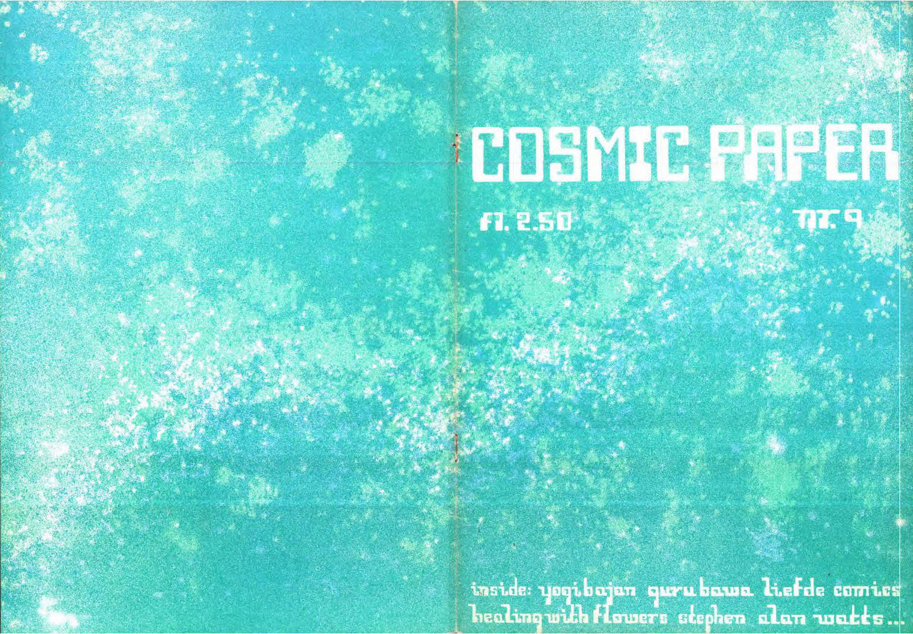
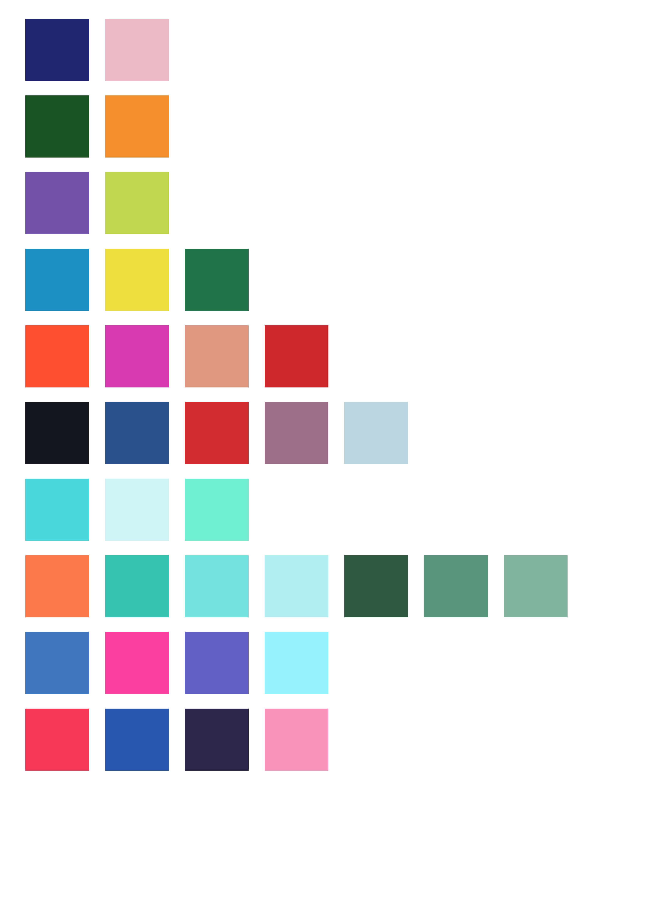

# Aliz Cosmic Paper README.md 

### Table of Contents
1. [Artefact](#Artefact)
    1. [Metadata](#Metadata)
2. [Research](#Research-h1)
3. [Transcoding](#Transcoding)
    1. [Transcoding No. 1](#Transcoding-no-1)
    2. [Transcoding Tool](#Transcoding-tool)
4. [Reflection](#Reflection)
5. [Outcome](#Outcome)
6. [Conclusion](#Conclusion)
7. [Bibliography](#Bibliography) 

# Artefact
Cosmic Paper was the magazine of De Kosmos Meditation Center at the Prins Hendrikkade in Amsterdam, the center that in the years 1969 to 1992 opened its doors to hundreds of thousands of young people in search for enlightenment, self-development and entertainment.  

## Metadata
| Tag | Data |  
|--|--|
**IISG Call Number** | [NIBG (Perscollectie) PM 16759](https://search.iisg.amsterdam/Record/1109411)
| **Physical Description** | Screen Printed
| **Type** | Object
| **Medium** | Magazine
| **Materials** | Paper
| **Date** | 1972
| One of the covers for the magazine Cosmic paper. A magazine for cosmic science with information, meditation and action, all in bold, expressive and colorful illustrations, symbolism and typography. 

# Cosmic Paper, the magazine of De Kosmos                                           

Cosmic Paper was the magazine of De Kosmos Meditation Center at the Prins Hendrikkade in Amsterdam, the center that in the years 1969 to 1992 opened its doors to hundreds of thousands of young people in search for enlightenment, self-development and entertainment. Cosmic Paper was the successor of De Kosmos’ first magazine, Lemuria, with twelve issues. Cosmic Paper published in total ten issues, the first issue came out in March 1972 and three years later, spring 1975, the last issue no. 12 saw the light. The numbering runs from 1 to 6 and then from 9 to 12. The issues no. 7 and no. 8 were never published. This jump in the numbering of issues probably had to do with the fact that the original planning of publishing a quarterly magazine could not be achieved. From the first issue onward Cosmic Paper profiled itself as the magazine with “a new age
approach to the now”. It rapidly became an icon of the hippie years of the beginning of the 1970s and was a source of inspiration and refuge for the many people searching for meaning. The Cosmic Paper office was located in the back house of De Kosmos building on the floor right under the large attic for zen meditation, the Zenzolder. A strikingly large editorial table was on the side of the windows, including a black and white television, and in the corner was the lightbox for the lay-out. Furthermore, there were two work desks, one for the administration and one for the mail order store, plus a storage room for books and records.

The ten issues were produced (“karmayogad together”) by a variable group of enthusiastic and driven staff workers, volunteers and artists, including a few people that set the tone during these three exciting years. When we browse through the issues, we get a clear view of those years of a rapidly changing interpretation of spirituality and self-development.

## A radical magazine 
Cosmic Paper was a magazine with a radical mission: sitting silent with eyes closed, lighting a joint or a prior consultation of the I Ching, it was absolutely not enough. It had to be a magazine for cosmic science with information, meditation and action, preferably in bold.

This vision had its roots in the beat and pop culture of America and Britain with their underground and multimedia arts and in the colourful mysticism from India, Tibet and Japan that was very popular in the West. Among the pioneers were for instance Richard Alpert (author of Be Here Now), Stephen Durkee (founder of Lama Foundation), Stephen Gaskin
(founder of The Farm) and Simon Vinkenoog (poet). They all had quite some influence on the style of Cosmic Paper. 

## To Change the World
Cosmic Paper wanted to change the world fast. The old world was ultimately dismissed and the new world had to be built. This came about through embracing all religious and spiritual theories and practices, through expanding the consciousness via soon to be legalized drugs and psychedelics, natural living and study. 

All over the world communes and spiritual initiatives were founded and Cosmic Paper wanted to be their voice. Even more, Cosmic Paper was the centre of a network of Dutch and international intentional communities, a network that was excellently documented in A Pilgrim’s Guide to Planet Earth, a reference book from this period. 

It was a strong sample of uncurbed optimism and sympathetic unworldlyness in a world that was torn by major international tensions, wars, attacks, scandals and car-free Sundays. Vietnam, Jom Kippur, Rote Armee, Watergate and the Provo party Kabouter, nothing of that sort seeped through to Cosmic Paper. Or could the origins of Cosmic Paper have been situated precisely there? 

### What Cosmic Paper stood for 
- Medium for new movements
- Multi-sided information
- A preparation for AQUARIUS
- A contribution from and for the (k)cosmos
- A joining of forces

Very characteristic were the graphics and the lay-out of the magazine. The artwork of Ioanna Salajan, Richard Lamm, Wiet Helweg and many other Dutch and international artists gave the magazine an almost fairylike sciencefiction look. The lay-out was pioneering and bursting with creativity.

The concern for people at the bottom of society was also typical for Cosmic Paper. Thus prisoners from all over the world, often in jail because of drugs, received free books that were donated by publishers. This was the Cosmic Paper Prison Project.

Another typical trait was the talent for public relations. The latest trends were given a forum. Great spiritual leaders such as HH the Dalai Lama, as well as common folk, were photographed while reading Cosmic Paper.

# De Kosmos' relation to IISH

Friday, July 8, 2016, the Kosmos Archive, as housed at the International Institute of Social History
(IISH), was given status.
Namely that of donation, which makes further planning, digitization, study and publication more possible.
Original copyrights, as applicable, will be maintained.

Eckart Dissen and Paul de Leenheer have signed for this agreement with the IISH. A copy of the agreement is available digitally for anyone who wants to.

The archive at the IISH led a 'floating life'. After the demise of the Kosmos in 1992, part of it ended up
privately at the University Library of the University of Amsterdam (UB / UvA). There the material was
described by identity under the direction of Tjebbe van Tijen, the UB archivist, after which the archive
was transferred to the IISH, as part of the UB / UvA's Social Documentation collection. 

Another part, the audio and video archive, which was managed by Eckart for almost 15 years, has also ended up at the IISH. It consists of collections from Kosmos Nieuwsblad, brochures plus a large number of photos. This archive contains 500+ audio tapes, films and all kinds of publications. This interesting archive, known to the IISH as 'the pallet', has not yet been described at all.

These projects are done with 100% voluntary efforts and partial support from the IISH.

It took almost two years to get to the threshold of further opening up the Kosmos Archive, which can form the basis for a good cultural-historical description. It goes without saying that we are only at the very beginning of this opening up of an era that will take a lot of time and effort. To give you an idea: the Kosmos Archive, excluding the pallet, covers four linear meters of archive boxes, side to back. The IISH estimates the costs for organization and digitization at € 8,000 per linear meter.

It is also important that the archives of Simon Vinkenoog, and part of the Milky Way and Paradiso are
housed at the IISH.

We have volunteered (no cost) to the IISH. The IISH is prepared to continue in accordance with its
scientific approach, taking into account its priorities. “First the archive of Karl Marx, then De
Kosmos”.

# Transcoding
*The focus of this project is exploring the visual and auditory language of the new Age movement, based on my findings and research on De Kosmos meditation centre, their magazine Called the Cosmic Papers and people and events that were involved with this organisation.* 

## Transcoding No. 1
### Transcoding 1 is the literary descriptions of the covers of the issues of Cosmic Papers. 

A woman is in industrial looking cosmic space surrounded by different types of structures, machine looking planets or aliens and mountains. The colours are light pink, dark blue and white. Her hair is pointing upwards and part of her head is made of the machine looking planets/aliens/structures. Everything seems to be connected to each other.

There is a long empty road that disappears into the distance. There are some distant lights far away. The ground and the sky are both green, the road is orange. There is a lot of emptiness. There are three floating objects in the air.

There is a baby in the middle of the page, who is protected by a bubble. Surrounding him are more bubbles that are smaller, that are interacting with other geometrical shapes. As they meet each other, new shapes are created. There is a sun inside a puddle under the baby and his bubble. There colours are purple, green and off-white color.

There are some tall trees on top of a mountain. There are more mountains in the distance., and some roads are leading towards them. The sun is also rising in the distance, behind the mountains, in the right, but the moon is also visible on the left. It’s a crescent moon. The colours are blue, yellow, green and white.

There is a quote about a dream that is illustrated. There are different typed of flowers, some butterflies that are interacting with the flowers and a man, standing in the middle of a big white flower. There are many different colours used, mainly shades of red, and blue, with an all black background.

There is dotted texture throughout the whole cover, with different shades of turquoise and white text.

There is a lotus flower in the middle on the left, and a woman in the middle on the right. Behind the woman in the distance there is a man . The lotus flower, and the woman with the man are surrounded by circles, and are connected to each other. The woman is holding balls/oranges in both her hands, one in each, holding them upward. She in under the moon and the man is looking out from the sun. The main colours are dark turquoise green, orange and white.

## Transcoding No. 2
### Transcoding 2 explores the color palettes of the covers different issues Cosmic papers (each row is a different issue.)

## Transcoding No. 3 
### Transcoding 3 explores the illustrations within the Cosmic Paper magazines and how they interact with each other by making a big collage of them.

## Transcoding No. 4 
### Transcoding 3 explores the illustrative typography within the Cosmic Paper magazines and how they interact with each other by making a big collage of them.

### Methods
Description of your methods, documentation of behind-the-scenes processes can go here. Think of the photos and videos you made when visiting the IISG or during captures of your artefact. You can use tools such as [Gifs.com](https://gifs.com/) to generate moving-image thumbnail to link to short videos.Just enough to give a clear overview, before getting into details.  

With some HTML tags you can do simple styling in markdown, for example:

    <width="50%">
<!------>--->

Remember to include the url link to jump to the full media, of course! 

### Tools 
Mention the tools that you used or made (if and when relevant). 

### Results
Some of your transcoding experiments may have smaller outcome sketches like images or short video tests. They can go directly within this section. Or maybe this transcoding became a part of the final outcome format. When that is the case, you can simply include a [hyperlink](#) to the final outcomes in the **Transcoding** section. In the final outcome section below you can embed or explain the final format outcome in detail.  

## Transcoding Tool 
### Description
You might have made multiple coding tools during the semester. Or the transcoding tool might be part of a specific transcoding experiment itself. It's up to you to define the linear flow of the Readme. Just like the transcoding of media itself, the coding tool should be well documented. So if you are using a coding tool in your first experiment, include the documentation of the coding tool **before** you include the results, etc. 

### Aims
Include the main aims or intentions behind making the tool, and what it is used for. 

### Methods
This includes the coding languages, coding frameworks or libraries, and any platforms or webtools for example.   

### Results
The coding tool will vary a lot between different students. So depending on the use and type, you may include more or less documentation here. 

### Source Links
Please include links to the tools, sources etc used during the coding. E.g. the resources used for making your coding tool.  
 

# Reflection
You might want to include a section about reflecting on the results of your coding and IMD experiments this semester. It can give additional context before reading the final outcomes below. 

# Outcomes
This section will be different for each student, depending on how and what is formatted as a final result for the semester assignment. Nevertheless a clear written and documented outcomes is important. So give the appropriate subsections or formats to make this as thorough as possible. 

### Outcome Links
Here you link to your final assignment outcomes. This could be a website, a video, etc etc. Please include links to the appropriate GitHub folder on your repository where your coding tool is stored. 

This is the main way to access your IMD + Coding outcomes for the semester. So its very important that you check for bugs, troubleshoot hyperlink issues, embedded media issues etc. Please make sure you KNOW where each file you use is stored. E.g. If you migrated from Notion markdown into GitHub, its **VERY IMPORTANT** to know that Notion randomly stores images on an Amazon server. It changes those locations all the time. So if your main outcome or documentation is still grabbing those links, **its very likely** they might disappear before collectives. So please have all media and necessary files managed well in your own locations (online or github etc).   

# Conclusion 
You might have a nice conclusive observation to share at the end :) 

## Bibliography
Of course, as with all research work please include a good bibliography with links, and any references that were used or might give additional depth to the work. 

<a name="footnote-1">**[1]**</a>: Look at this little referenced footnote over here. You can look up different text formats for referencing books, online articles, films etc. 

